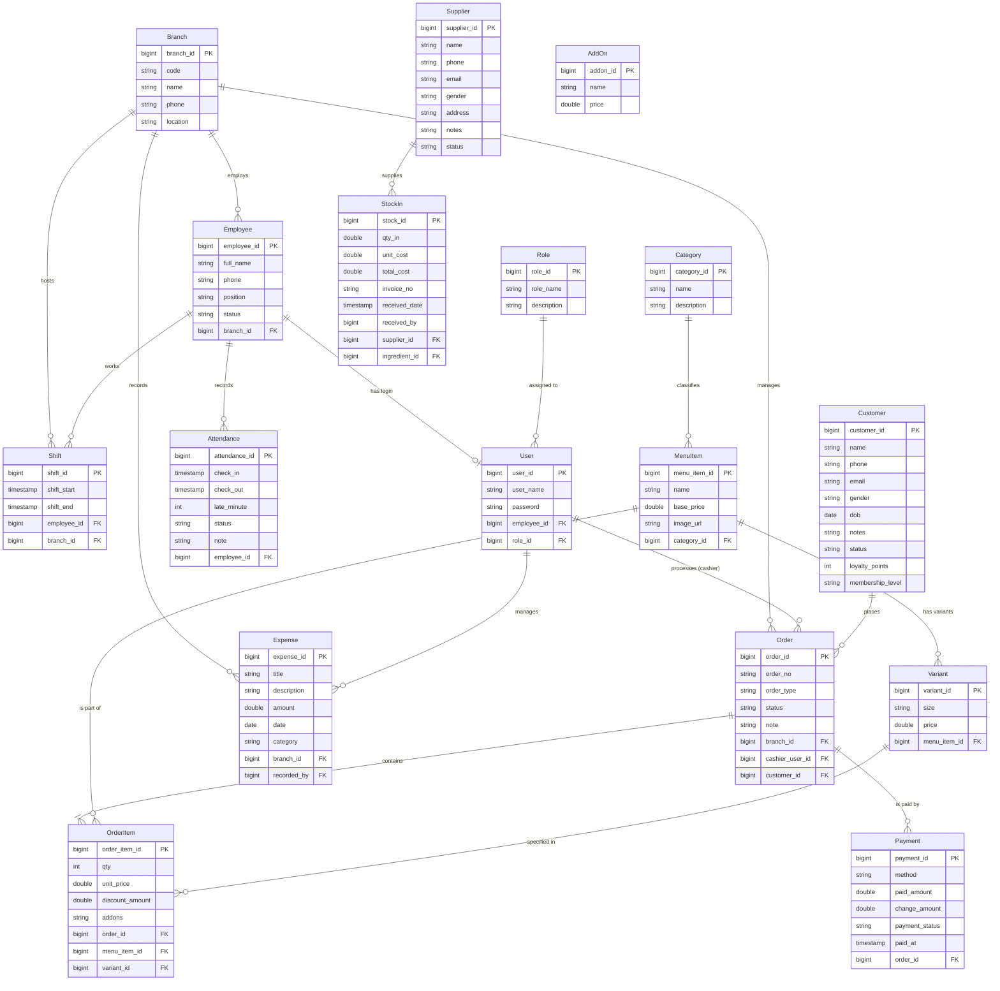

# Database Schema

## ER Diagram (Conceptual)

## Table Specifications

### Core Tables
| Table Name | Entity | Description |
|------------|--------|-------------|
| `tblbranches` | `BranchEntity` | Physical cafe locations. |
| `tblemployees` | `EmployeeEntity` | Staff members details. |
| `tblusers` | `UserEntity` | System login credentials linked to employees. |
| `tblroles` | `RoleEntity` | User roles (Admin, Cashier, etc.) for permission control. |
| `tblcustomers` | `CustomerEntity` | Registered loyalty customers. |

### Menu & Inventory
| Table Name | Entity | Description |
|------------|--------|-------------|
| `tblcategories` | `CategoryEntity` | Menu categories (Coffee, Tea, Pastry). |
| `tblmenu_items` | `MenuItemEntity` | Base products. |
| `tblvariants` | `VariantEntity` | Product size variations (S, M, L). |
| `tbladdons` | `AddOnEntity` | Extra items (Sugar, Shot). |
| `tblsuppliers` | `SupplierEntity` | External vendors for ingredients. |
| `tblstock` | `StockInEntity` | Inventory intake logs. |

### Sales & Operations
| Table Name | Entity | Description |
|------------|--------|-------------|
| `tblorders` | `OrderEntity` | Main transaction record. |
| `tbl_order_items` | `OrderItemEntity` | Individual items within an order. |
| `tblpayments` | `PaymentEntity` | Payment transactions and records. |
| `tblshifts` | `ShiftEntity` | Employee work schedules. |
| `tblattendance` | `AttendanceEntity` | Actual clock-in/clock-out records. |
| `tblexpenses` | `ExpenseEntity` | Record of daily store operation costs. |

## Naming Conventions
*   **Tables**: `snake_case`, prefixed with `tbl` (e.g., `tblbranches`, `tblusers`) except join tables (e.g., `tbl_order_items`).
*   **Columns**: `snake_case` matching Java camelCase fields (e.g., `fullName` -> `full_name`).
*   **Primary Keys**: `{entity_name}_id` (e.g., `branch_id`).
*   **Foreign Keys**: `{referenced_entity}_id`.
