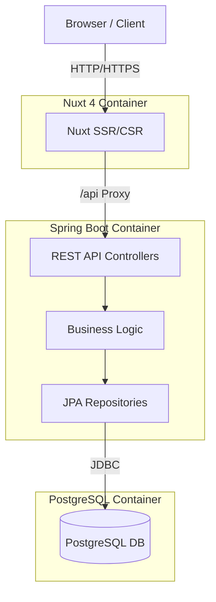

# System Architecture

## Technology Stack

### Frontend
* **Framework**: [Nuxt 4](https://nuxt.com) (Vue 3)
* **Language**: TypeScript
* **Styling**: TailwindCSS
* **Icons**: Lucide (via SVGs)
* **State Management**: Built-in Nuxt/Vue composables

### Backend
* **Framework**: Spring Boot 3
* **Language**: Java 21/25
* **Database**: PostgreSQL 16
* **Build Tool**: Maven

### Infrastructure
* **Containerization**: Docker & Docker Compose
* **Orchestration**: Docker Compose (Local/Dev)

## High-Level Diagram

## Key Design Decisions
1. **Nuxt 4 `app/` Directory**: We utilize the new Nuxt 4 structure where all application source code lives in `frontend/app/` to keep the root clean.
2. **Dedicated DTO Layer**: The backend strictly uses DTOs for all Controller interactions, never exposing Entities directly.
3. **API Proxy**: In development, Nuxt proxies `/api` requests to the Spring Boot backend to avoid CORS issues and simplify configuration.
